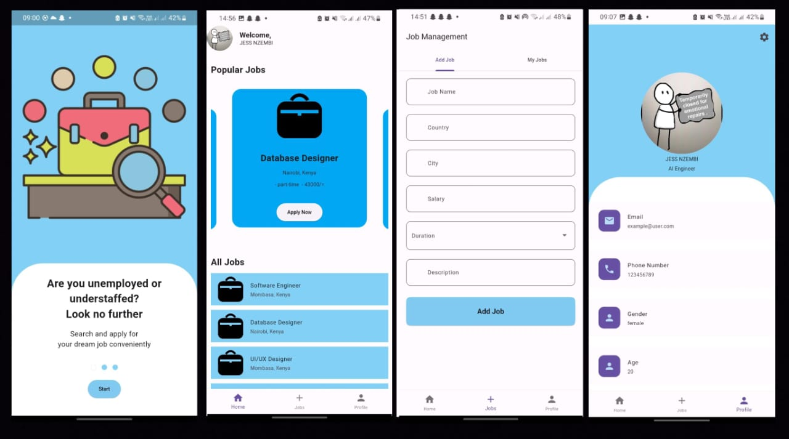

# hirehub

A Flutter application for job searching and posting.

## Features
- Adding a job
- Deletind a job
- Details to apply for a job
- Updating user profile

## Screenshots



## Run Locally

Install [Flutter](https://flutter.dev/docs/get-started/install).

Clone the project

```bash
  git clone https://github.com/jessNzembi/hirehub.git
```

Go to the project directory

```bash
  cd hirehub
```

Install dependencies

```bash
  flutter pub get
```

Run the app

```bash
  flutter run
```

## Contributing

Contributions are always welcome! If you have any ideas or suggestions, please open an issue or submit a pull request.

## License

[MIT](https://choosealicense.com/licenses/mit/)
